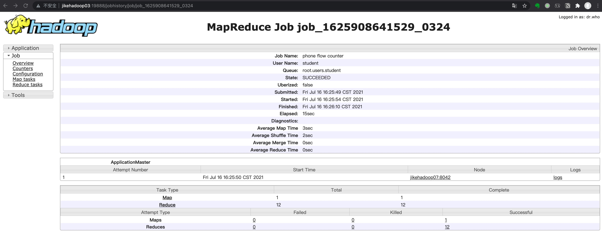
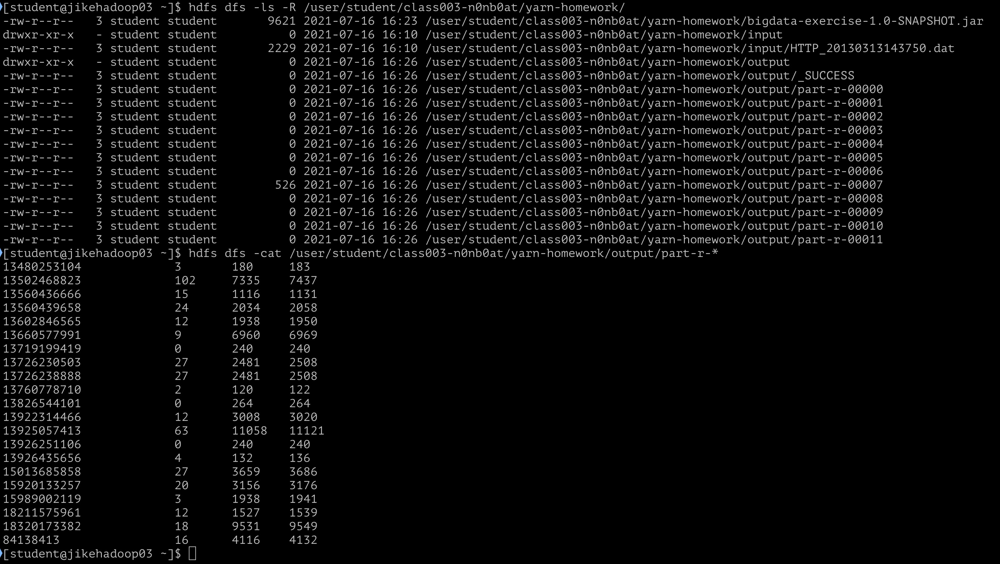
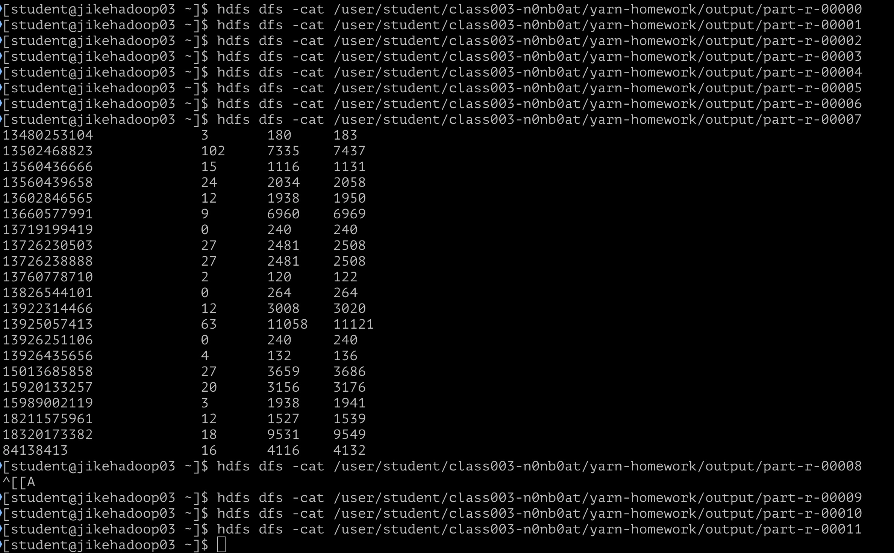
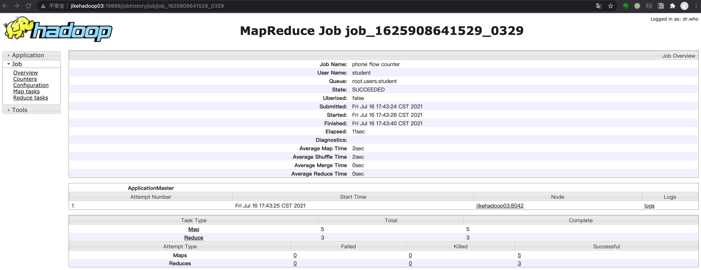
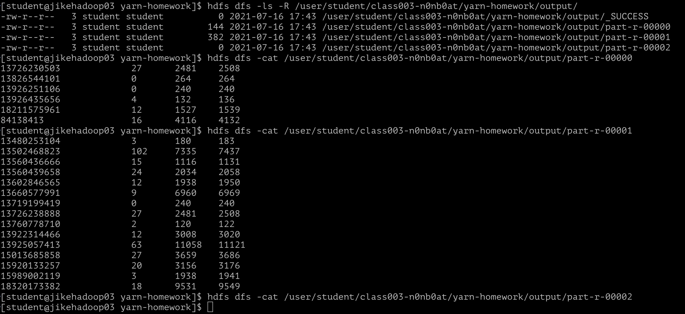

# MapReduce 作业

### Code

主逻辑代码 [PhoneFlowStatistic](../../bigdata-exercise/src/main/java/org/n0nb0at/phoneflow/PhoneFlowStatistic.java)

Key 对象 [PhoneBean](../../bigdata-exercise/src/main/java/org/n0nb0at/phoneflow/PhoneBean.java)

Value 对象 [FlowBean](../../bigdata-exercise/src/main/java/org/n0nb0at/phoneflow/FlowBean.java)

### Result

设置 Reducer 为 1：http://jikehadoop03:19888/jobhistory/job/job_1625908641529_0322


使用默认 Reducer 数量：http://jikehadoop03:19888/jobhistory/job/job_1625908641529_0324


本地执行的时候，发现虽然产生 `output` 文件，但实际上只有一个存在输出。应该是老师讲的服务默认配置的 `split.size` 大于文件大小。

整体输出：


每个文件的输出：


### 自定义切分大小和 `Reducer` 数量

后续查看输入文件大概2.2kb，设置了最大输入切分大小和 `Reducer` 数量：

``` Java
FileInputFormat.setMaxInputSplitSize(job, 512);
job.setNumReduceTasks(3);
```

然后得到结果：

http://jikehadoop03:19888/jobhistory/job/job_1625908641529_0329




最终看到，Job 内切分了 5 个 `Mapper`，3 个 `Reducer`。

实际本地跑可以看到3个 `Reducer` 都有对应的输出，线上还是只有两个 `Reducer` 收到了任务。
