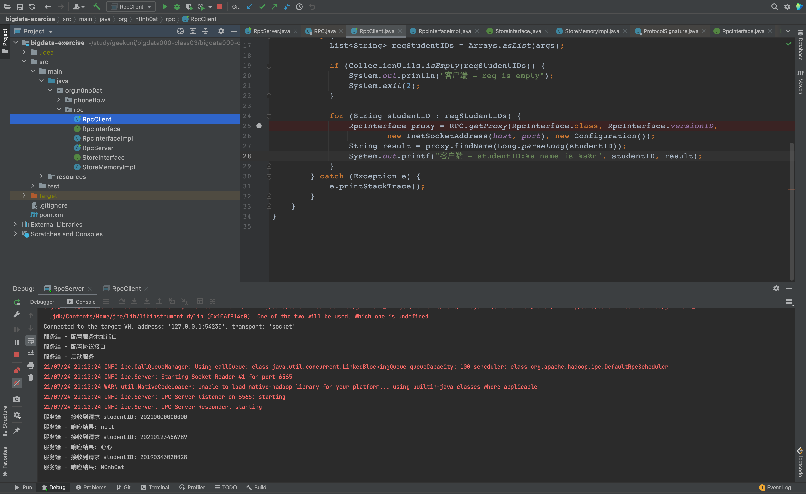
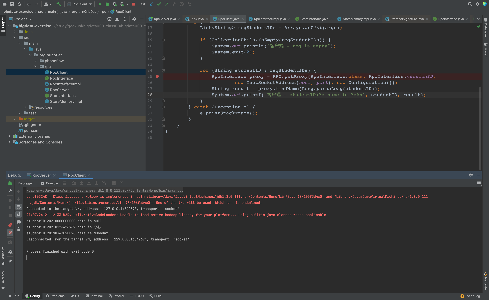

# Hadoop RPC 作业

### Code

RPC 接口 [RpcInterface](../../bigdata-exercise/src/main/java/org/n0nb0at/rpc/RpcInterface.java)

RPC 接口实现 [RpcInterfaceImpl](../../bigdata-exercise/src/main/java/org/n0nb0at/rpc/RpcInterfaceImpl.java)

RPC 服务端 [RpcServer](../../bigdata-exercise/src/main/java/org/n0nb0at/rpc/RpcServer.java)

RPC 客户端 [RpcClient](../../bigdata-exercise/src/main/java/org/n0nb0at/rpc/RpcClient.java)

数据存储查询接口
 [StoreInterface](../../bigdata-exercise/src/main/java/org/n0nb0at/rpc/StoreInterface.java)

数据存储查询内存实现
 [StoreInterface](../../bigdata-exercise/src/main/java/org/n0nb0at/rpc/StoreInterface.java)

### Result

服务端

客户端

