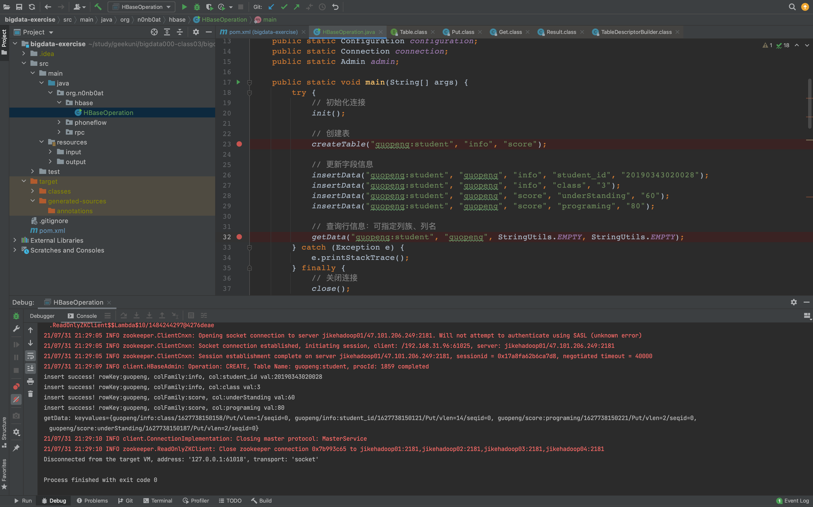
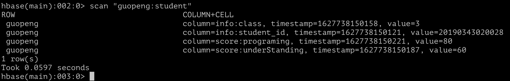

# Hadoop RPC 作业

### Code

HBaseOperation [HBaseOperation](../../bigdata-exercise/src/main/java/org/n0nb0at/hbase/HBaseOperation.java)

### Result

#### 通过客户端创建记录

创建 `$name:student` 的表，中间出现过 `org.apache.hadoop.hbase.NamespaceNotFoundException` 报错，查询了需要先创建命名空间:

#### 通过命令行检查表内容

除了作业内提到的创建、写入等操作，在自己集群上尝试了其他命名空间、表、数据的命令行操作。
