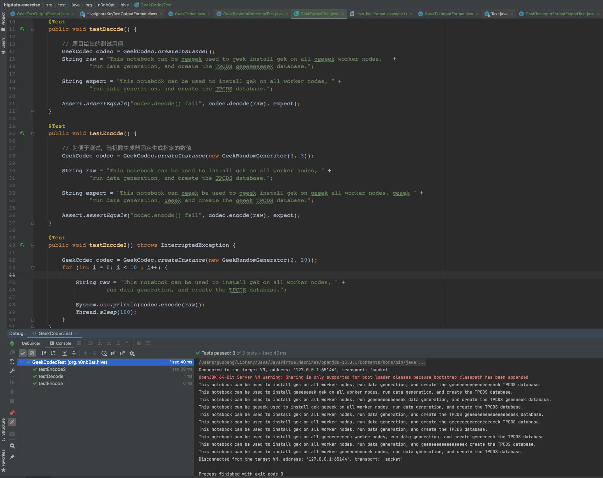
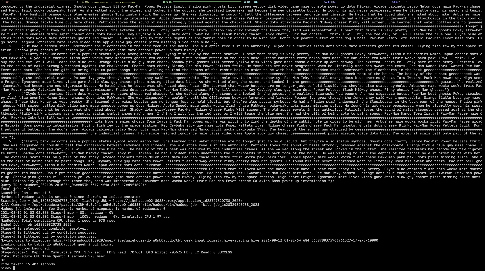
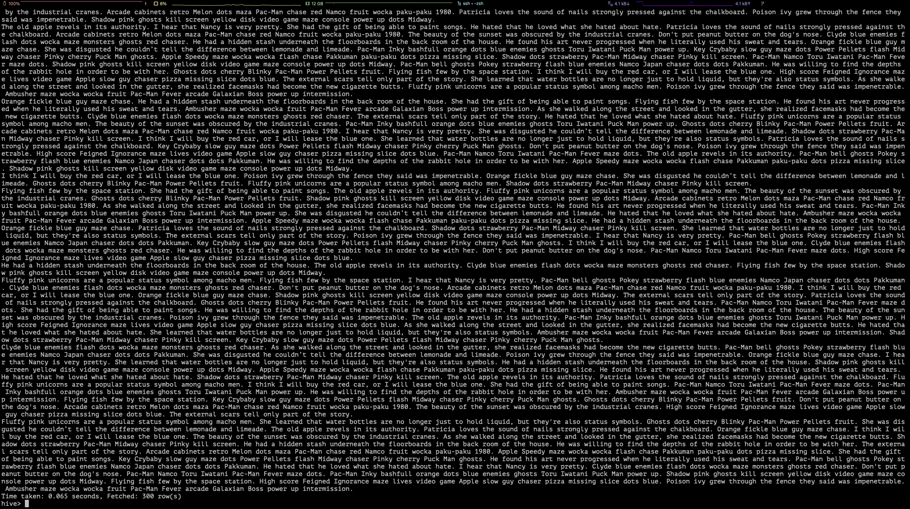
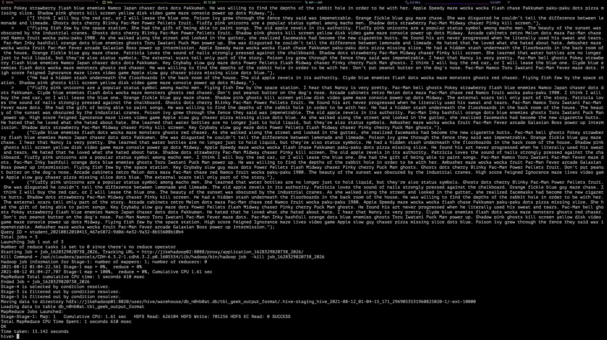
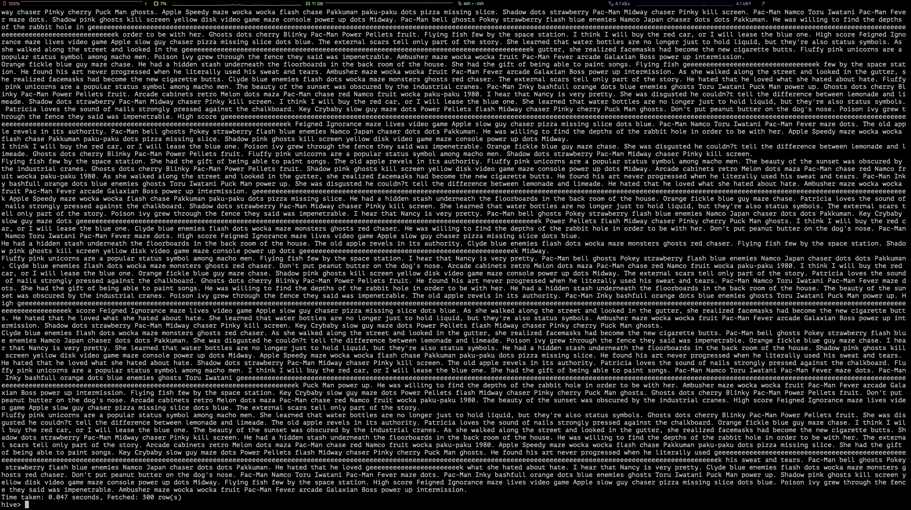

# 附加作业：GeekFileFormat

按作业内容查看了 `Base64TextInputFormat` 和 `Base64TextOutputFormat` 的代码，又从网上查询了一些自定义 `Hive Format` 相关的文章，大致可以将作业分为以下几个内容：

- 实现一个自定义编解码工具类，达到对 `ge{2,}k` 字符的编码、解码处理
- 实现 `GeekTextInputFormat` 和 `GeekTextOutputFormat`，对 Hive 表进行格式化处理
- 将自定义格式化代码上传服务器并执行

## 一、编解码工具类

解码规则比较简单：

> 解密规则如下：文件中出现任何的geek，geeeek，geeeeeeeeeeek等单词时，进行过滤，即删除该单词。gek需要保留。字母中连续的“e”最大长度为256个。
> - 例如：This notebook can be geeeek used to geek install gek on all geeeek worker nodes, run data generation, and create the TPCDS geeeeeeeeek database.
> - 解密为：This notebook can be used to install gek on all worker nodes, run data generation, and create the TPCDS database.

使用正则替换即可：

``` Java
public String decode(String raw) {
    // 将「符合规则的单词」及其「前面可能包含的空格」，替换为空字符
    return raw.replaceAll("\\s*ge{2,}k", StringUtils.EMPTY);
}
```

编码要求：

> 加密规则如下：文件输出时每随机2到256个单词，就插入一个gee...k，字母e的个数等于前面出现的非gee...k单词的个数。
> -  例如：    This notebook can be used to install gek on all worker nodes, run data generation, and create the TPCDS database.
> - 加密为：This notebook can be geeeek used to geek install gek on all geeeek worker nodes, run data generation, and create the TPCDS geeeeeeeeek database.

编码规则需要轮询计数，暂时没找到更好的处理办法，直接暴力循环处理：

``` Java
public String encode(String raw) {
    StringBuilder sb = new StringBuilder();
    String[] words = raw.split(" ");

    Integer randomNo = randomGenerator.generate();
    int size = words.length;
    // offset 用于记录所有单词的拼接偏移量
    int offset = 0;
    // insertOffset 用于记录下一次插入自定义单词的位置
    int insertOffset = randomNo;

    // 插入便宜要小于句子总单词数
    int insertedCount = 0;
    while (insertOffset < size + insertedCount) {
        // 将下一次插入自定义单词之前的位置先拼接
        for (; offset + insertedCount < insertOffset; offset++) {
            sb.append(words[offset]);
            // 最后一个单词之后不追加空格
            if (offset != size - 1) {
                sb.append(" ");
            }
        }
        // 将自定义单词拼接上
        sb.append(generateCustomWord(randomNo)).append(" ");
        // 原句单词数量 + 1，用于下一次是否可插入的判断
        insertedCount++;
        insertOffset++;
        // 继续机选下一次插入位置
        randomNo = randomGenerator.generate();
        insertOffset += randomNo;
    }

    // 剩余未拼接完的内容继续拼接
    for (; offset + insertedCount < size + insertedCount; offset++) {
        sb.append(words[offset]);
        // 最后一个单词之后不追加空格
        if (offset != size - 1) {
            sb.append(" ");
        }
    }

    return sb.toString();
}
```

测试结果：



除了作业中的两个例子，编码单独写了一个指定20字符内（例句长度，也方便人数）的随机数，人工建能查了正确性。

还通过一个免费在线生成测试文本『[文字生产器](https://anytexteditor.com/cn/text-generator)』，拿长文本文件跑了一遍，鉴于不可读，就没贴截图。

文本结果：

[待格式化文本](../../../bigdata-exercise/src/test/resources/hive-homework-format-text.txt)

[格式后文本](../../../bigdata-exercise/src/test/resources/hive-homework-formatted-text.txt)

完整代码：

[编解码工具类](../../../bigdata-exercise/src/main/java/org/n0nb0at/hive/codec/GeekCodec.java)

[编解码测试代码](../../../bigdata-exercise/src/test/java/org/n0nb0at/hive/GeekCodecTest.java)

[随机数工具类](../../../bigdata-exercise/src/main/java/org/n0nb0at/hive/util/GeekRandomGenerator.java)

[随机数测试代码](../../../bigdata-exercise/src/test/java/org/n0nb0at/hive/GeekRandomGeneratorTest.java)

## 二、实现自定义 `Format`

根据 `Base64TextInputFormat` 和 `Base64TextOutputFormat`，实际上需要变动的部分只有编解码部分。

即重写 `RecordReader.next()` 和 `RecordWriter.write()`  部分：

``` Java
public boolean next(LongWritable key, BytesWritable value) throws IOException {
    byte[] binaryData;
    int i;
    do {
        if (!this.reader.next(key, this.text)) {
            return false;
        }

        // 使用自定义解码
        String formatStr = this.geekCodec.decode(this.text.toString());

        this.text.set(formatStr);

        byte[] textBytes = this.text.getBytes();
        int length = this.text.getLength();
        if (length != textBytes.length) {
            textBytes = Arrays.copyOf(textBytes, length);
        }

        binaryData = textBytes;

        for (i = 0; i < binaryData.length && i < this.signature.length && binaryData[i] == this.signature[i]; ++i) {
        }
    } while (i != this.signature.length);

    value.set(binaryData, this.signature.length, binaryData.length - this.signature.length);
    return true;
}
```

``` Java
public void write(Writable w) throws IOException {
    String formatStr;
    if (w instanceof Text) {
        // 更新为编码后的文本
        formatStr = this.geekCodec.encode(((Text) w).toString());
        ((Text) w).set(formatStr);
    } else {
        assert w instanceof BytesWritable;
        // 更新为编码后的文本
        formatStr = this.geekCodec.encode(new String(((BytesWritable) w).getBytes()));
    }

    byte[] output = formatStr.getBytes();

    this.bytesWritable.set(output, 0, output.length);
    this.writer.write(this.bytesWritable);
}
```

其中踩了两个坑：

1. 一开始觉得 `Base64TextInputFormat` 代码逻辑较多，想直接继承 `TextInputFormat`，最终没试成功，后续有机会的话再进一步尝试。
2. `OutputFormat` 同上，也想使用继承 `TextOutputFormat` 的方式，这个是明确提示报错，没有实现 `HiveIgnoreKeyTextOutputFormat` 的话，无法通过 `Hive-Shell` 来获取数据。

完整代码：

[GeekTextInputFormat](../../../bigdata-exercise/src/main/java/org/n0nb0at/hive/GeekTextInputFormat.java)

[GeekTextOutputFormat](../../../bigdata-exercise/src/main/java/org/n0nb0at/hive/GeekTextOutputFormat.java)

## 三、上传代码并执行

最开始的理想情况是这样的：

``` SQL
-- 创建库
CREATE DATABASE IF NOT EXISTS db_n0nb0at;

-- 跳转 DB
USE db_n0nb0at;

-- 创建 format 表
CREATE TABLE IF NOT EXISTS tbl_geek_format (
    `formatText` STRING COMMENT '格式化数据'
) STORED AS
INPUTFORMAT 'org.n0nb0at.hive.GeekTextInputFormat'
OUTPUTFORMAT 'org.n0nb0at.hive.GeekTextOutputFormat'
LOCATION '/user/student/class003-n0nb0at/hive-homework/';

-- 加载数据
LOAD DATA LOCAL INPATH "/home/student/class003-n0nb0at/hive-homework/data" OVERWRITE INTO TABLE db_n0nb0at.tbl_geek_format;

```

后续分别遇到几个问题：

1、没有 `${HIVE_HOME}/auxlib` 的创建权限，也没配置 CDH 的自定义 jar 放置目录

这个问题会导致无法加载自定义的 `Format` 类文件，只能通过 `Hive-Shell` 内执行添加语句，不好的地方就是仅当次会话有效：

``` SQL
-- 添加自定义 jar 
ADD JAR /home/student/class003-n0nb0at/hive-homework/bigdata-exercise-1.0-SNAPSHOT.jar
```

2、通过 `LOAD DATA INPATH` 的方式加载数据不会经过自定义的 `Format`

测试得到的结果是只有通过常规 SQL 指令插入、读取的内容才会经过自定义格式化。

``` SQL
-- 插入数据
INSERT INTO tbl_geek_format (`formattext`) VALUES ("TEST geek.The second sentence for geeeek.");
```

3、一并使用 `GeekTextInputFormat` 和 `GeekTextOutputFormat` 的话，没有办法明确是否加密成功

解密的话（通过 `GeekTextInputFormat` 读取)，可以在写入的时候，原始文本就带有多出的 `ge{2,}k` 字符传，读取时会被移除。

加密的话没有找到好的方式处理，在群内咨询了，其他同学暂时也没有更好的方法。只能分开验证。

``` SQL
-- 使用自定义 inputFormat
TRUNCATE TABLE db_n0nb0at.tbl_geek_input_format;
DROP TABLE IF EXISTS db_n0nb0at.tbl_geek_input_format;
CREATE TABLE IF NOT EXISTS tbl_geek_input_format (
    `formatText` STRING COMMENT '格式化数据'
)
STORED AS
INPUTFORMAT 'org.n0nb0at.hive.GeekTextInputFormat'
OUTPUTFORMAT 'org.apache.hadoop.hive.ql.io.HiveIgnoreKeyTextOutputFormat';

-- 使用自定义 output
TRUNCATE TABLE db_n0nb0at.tbl_geek_output_format;
DROP TABLE IF EXISTS db_n0nb0at.tbl_geek_output_format;
CREATE TABLE IF NOT EXISTS tbl_geek_output_format (
    `formatText` STRING COMMENT '格式化数据'
)
STORED AS
INPUTFORMAT 'org.apache.hadoop.mapred.TextInputFormat'
OUTPUTFORMAT 'org.n0nb0at.hive.GeekTextOutputFormat';
```

插入数据：[inser_input_format.sql](inser_input_format.sql) & [insert_output_format.sql](insert_output_format.sql)

读写结果：

input_format_insert_result:



input_format_select_result:



output_format_insert_result:



output_format_select_result:



测试数据是跑本地编解码测试的，人工检查了两条，符合要求，鉴于测试文本过长，没有挨个检查。

就像老师说的，不是很难，但是想完全跑下来，还是很花时间的……

感谢审阅~
