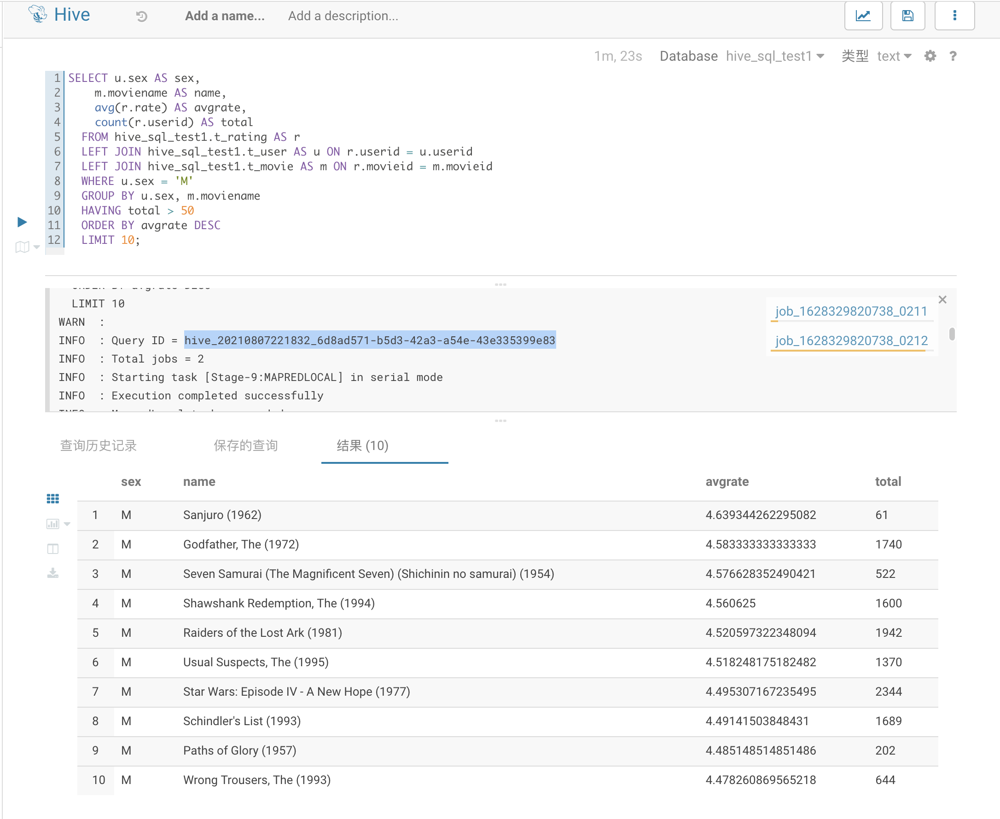

# Hive SQL 作业

### Code


#### 题目一：展示电影ID为2116这部电影各年龄段的平均影评分

``` SQL
SELECT u.age AS age, avg(r.rate) AS avgrate
    FROM hive_sql_test1.t_user AS u
    LEFT JOIN hive_sql_test1.t_rating AS r ON u.userid = r.userid
    WHERE r.movieid = 2116
    GROUP BY u.age;
```


#### 题目二：找出男性评分最高且评分次数超过50次的10部电影，展示电影名，平均影评分和评分次数

``` SQL
SELECT u.sex AS sex, 
        m.moviename AS name, 
        avg(r.rate) AS avgrate, 
        count(r.userid) AS total 
    FROM hive_sql_test1.t_user AS u 
    LEFT JOIN hive_sql_test1.t_movie AS m 
    LEFT JOIN hive_sql_test1.t_rating AS r ON u.userid = r.userid
    WHERE u.sex = 'M'
    GROUP BY u.userid, u.sex, m.moviename
    HAVING total > 50
    ORDER BY avgrate DESC 
    LIMIT 10;
```




#### 题目三：找出影评次数最多的女士所给出最高分的10部电影的平均影评分，展示电影名和平均影评分（可使用多行SQL）

这题可以分成三个部分来做：

- 找出点评最多的女士
- 找出该女士评分最高的10部电影
- 找出对应电影的平均得分

拆分 `SQL` 如下：

1、找出点评最多的女士

``` SQL
SELECT u.userid
  FROM hive_sql_test1.t_rating AS r
  LEFT JOIN hive_sql_test1.t_user AS u ON r.userid = u.userid
  WHERE u.sex = 'F'
  GROUP BY u.userid 
  ORDER BY count(r.userid) DESC
  LIMIT 1;
```


2、找出该女士评分最高的10部电影

``` SQL
SELECT r.movieid, r.rate 
  FROM hive_sql_test1.t_rating AS r 
  WHERE r.userid=1150
  ORDER BY r.rate DESC
  LIMIT 10;
```


3、找出对应电影的平均得分

``` SQL
SELECT m.moviename, avg(r.rate) AS avgrate
    FROM (SELECT r.movieid, r.rate 
        FROM hive_sql_test1.t_rating AS r 
        WHERE r.userid=1150
        ORDER BY r.rate DESC
        LIMIT 10) AS top10 
    LEFT JOIN hive_sql_test1.t_rating AS r ON r.movieid = top10.movieid
    LEFT JOIN hive_sql_test1.t_movie AS m ON r.movieid = m.movieid 
    GROUP BY m.moviename;
```


在执行上面的查询过程中，发现好多全是评分为5分的电影，结果也和老师贴图的不一样。猜测最高分电影不止 10 部，于是进行了验证：


该女士评分为 5 分的电影总共 59 部，[结果导出文件(csv)](mostCommentFemale_rate5movies.csv)。题干没有给出进一步排序或其他过滤规则，所以个人觉得和老师截图不一样，也是正确的。

最后，又将几个 `SQL` 合并进行了验证：

``` SQL
SELECT m.moviename, avg(r.rate) AS avgrate
    FROM (SELECT r.movieid, r.rate 
        FROM (SELECT u.userid, count(r.userid) AS total
                FROM hive_sql_test1.t_rating AS r
                LEFT JOIN hive_sql_test1.t_user AS u ON r.userid = u.userid
                WHERE u.sex = 'F'
                GROUP BY u.userid 
                ORDER BY total DESC
                LIMIT 1) AS mostCommentFemale
            LEFT JOIN hive_sql_test1.t_rating AS r ON mostCommentFemale.userid = r.userid
        ORDER BY r.rate DESC
        LIMIT 10) AS top10 
    LEFT JOIN hive_sql_test1.t_rating AS r ON r.movieid = top10.movieid
    LEFT JOIN hive_sql_test1.t_movie AS m ON r.movieid = m.movieid 
    GROUP BY m.moviename;
```


结果与之前分开执行的一致。

### 附加作业：GeekFileFormat

``` Shell
TODO 正在研究，后续补充
```
