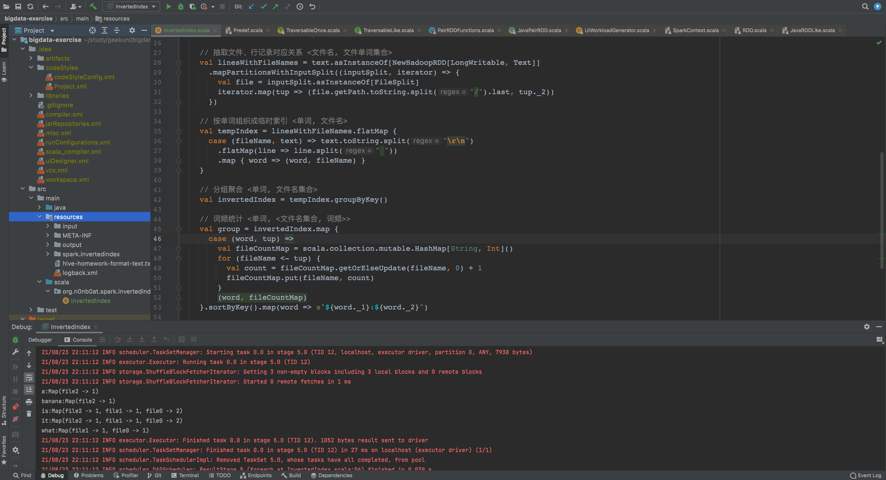

# Spark Core 作业

## InvertedIndex 倒排索引

### Code

[InvertedIndex](../../bigdata-exercise/src/main/scala/org/n0nb0at/spark/invertedindex/InvertedIndex.scala)

### 思路

之前看王争老师的『数据结构与算法之美』专栏，有提到过倒排索引相关的内容：[剖析搜索引擎背后的经典数据结构和算法](https://time.geekbang.org/column/article/79433)

创建倒排索引可分为以下几个步骤：

- 构建 <文件名, 文件单词集合>
- 按单词组织成临时索引 <单词, 文件名>
- 分组聚合 <单词, 文件名集合>

代码如下：

``` Scala
object InvertedIndex {
  def main(args: Array[String]): Unit = {
    // 环境配置，使用本地
    val sparkConf = new SparkConf().setAppName("InvertedIndex").setMaster("local")
    val sc = new SparkContext(sparkConf)

    if (args.length != 2) {
      println("参数错误，入参为：[输入文件路径] [输出文件路径] ")
    }

    val inputPath: String = args.apply(0)
    val outputPath: String = args.apply(1)

    // 获取输入文件
    val fc = classOf[TextInputFormat]
    val kc = classOf[LongWritable]
    val vc = classOf[Text]
    val text = sc.newAPIHadoopFile(inputPath, fc, kc, vc, sc.hadoopConfiguration)

    // 抽取文件、行记录对应关系 <文件名, 文件单词集合>
    val linesWithFileNames = text.asInstanceOf[NewHadoopRDD[LongWritable, Text]]
      .mapPartitionsWithInputSplit((inputSplit, iterator) => {
        val file = inputSplit.asInstanceOf[FileSplit]
        iterator.map(tup => (file.getPath.toString.split("/").last, tup._2))
      })

    // 按单词组织成临时索引 <单词, 文件名>
    val tempIndex = linesWithFileNames.flatMap {
      case (fileName, text) => text.toString.split("\r\n")
        .flatMap(line => line.split(" "))
        .map { word => (word, fileName) }
    }

    // 分组聚合 <单词, 文件名集合>
    val invertedIndex = tempIndex.groupByKey()

    // 词频统计 <单词, <文件名集合, 词频>>
    val group = invertedIndex.map {
      case (word, tup) =>
        val fileCountMap = scala.collection.mutable.HashMap[String, Int]()
        for (fileName <- tup) {
          val count = fileCountMap.getOrElseUpdate(fileName, 0) + 1
          fileCountMap.put(fileName, count)
        }
        (word, fileCountMap)
    }.sortByKey().map(word => s"${word._1}:${word._2}")

    // 命令行输出
    group.repartition(1).foreach(println)
    // 文件输出
    group.repartition(1).saveAsTextFile(outputPath)
  }
}
```

到分组聚合那一步的时候基本都很顺畅，也和可以找到参考的资料大致吻合。

要求最后加上的词频部分，查阅、尝试了很多 `RDD` 操作，没有找到更合适的办法，只能自己暴力拼接一下，希望后续老师和助教能帮忙解惑。

### Result

本地运行结果，为了方便展示，最后进行了 `.repartition(1)`



## DistCP 的 Spark 实现

``` Shell
TODO: 探索中
```
