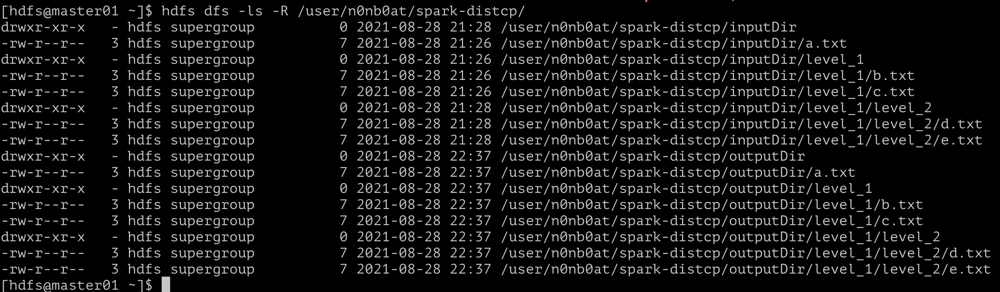

# Spark Core 作业

## InvertedIndex 倒排索引

### Code

[InvertedIndex](../../bigdata-exercise/src/main/scala/org/n0nb0at/spark/invertedindex/InvertedIndex.scala)

### 思路

之前看王争老师的『数据结构与算法之美』专栏，有提到过倒排索引相关的内容：[剖析搜索引擎背后的经典数据结构和算法](https://time.geekbang.org/column/article/79433)

创建倒排索引可分为以下几个步骤：

- 构建 <文件名, 文件单词集合>
- 按单词组织成临时索引 <单词, 文件名>
- 分组聚合 <单词, 文件名集合>

代码如下：

``` Scala
object InvertedIndex {
  def main(args: Array[String]): Unit = {
    // 环境配置，使用本地
    val sparkConf = new SparkConf().setAppName("InvertedIndex").setMaster("local")
    val sc = new SparkContext(sparkConf)

    if (args.length != 2) {
      println("参数错误，入参为：[输入文件路径] [输出文件路径] ")
    }

    val inputPath: String = args.apply(0)
    val outputPath: String = args.apply(1)

    // 获取输入文件
    val fc = classOf[TextInputFormat]
    val kc = classOf[LongWritable]
    val vc = classOf[Text]
    val text = sc.newAPIHadoopFile(inputPath, fc, kc, vc, sc.hadoopConfiguration)

    // 抽取文件、行记录对应关系 <文件名, 文件单词集合>
    val linesWithFileNames = text.asInstanceOf[NewHadoopRDD[LongWritable, Text]]
      .mapPartitionsWithInputSplit((inputSplit, iterator) => {
        val file = inputSplit.asInstanceOf[FileSplit]
        iterator.map(tup => (file.getPath.toString.split("/").last, tup._2))
      })

    // 按单词组织成临时索引 <单词, 文件名>
    val tempIndex = linesWithFileNames.flatMap {
      case (fileName, text) => text.toString.split("\r\n")
        .flatMap(line => line.split(" "))
        .map { word => (word, fileName) }
    }

    // 分组聚合 <单词, 文件名集合>
    val invertedIndex = tempIndex.groupByKey()

    // 词频统计 <单词, <文件名集合, 词频>>
    val group = invertedIndex.map {
      case (word, tup) =>
        val fileCountMap = scala.collection.mutable.HashMap[String, Int]()
        for (fileName <- tup) {
          val count = fileCountMap.getOrElseUpdate(fileName, 0) + 1
          fileCountMap.put(fileName, count)
        }
        (word, fileCountMap)
    }.sortByKey().map(word => s"${word._1}:${word._2}")

    // 命令行输出
    group.repartition(1).foreach(println)
    // 文件输出
    group.repartition(1).saveAsTextFile(outputPath)
  }
}
```

到分组聚合那一步的时候基本都很顺畅，也和可以找到参考的资料大致吻合。

要求最后加上的词频部分，查阅、尝试了很多 `RDD` 操作，没有找到更合适的办法，只能自己暴力拼接一下，希望后续老师和助教能帮忙解惑。

### Result

本地运行结果，为了方便展示，最后进行了 `.repartition(1)`


## DistCP 的 Spark 实现

``` Shell
TODO: 探索中
```

听了老师周日课程的讲解，大致思路和之前想的是基本一样的，但是如何实现还在探索中。

这次作业很多时间都是在学习 `Scala` 和 `RDD 算子` 怎么使用，如何实现一个完整的 `DistCP` 还是有些吃力。

只能先从模仿中学习，正在看 [CoxAutomotiveDataSolutions/spark-distcp](https://github.com/CoxAutomotiveDataSolutions/spark-distcp) & [scala-lang/spark-distcp](https://index.scala-lang.org/coxautomotivedatasolutions/spark-distcp/spark-distcp/0.2.2?target=_2.12)。这是同一个项目，一个是源码，一个是包管理工具的配置。

一开始下载了源码，但是 `sbt` 编译麻烦，重新拉取了 `maven` 包在看。

### Code

[DistCp](../../bigdata-exercise/src/main/scala/org/n0nb0at/spark/distcp/DistCp.scala)

[OptionsParsing](../../bigdata-exercise/src/main/scala/org/n0nb0at/spark/distcp/OptionsParsing.scala)

[SparkDistCPOptions](../../bigdata-exercise/src/main/scala/org/n0nb0at/spark/distcp/SparkDistCPOptions.scala)

### 实现

终于做完了 o(╥﹏╥)o

总体实现的内容分为一下几个部分：

- 命令行参数解析：使用 scopt.OptionParser
- 文件路径的检查
- 文件复制实现
- spark-submit 操作

一开始以为老师答疑部分写的只是伪码，就去网上找了 `spark-distcp` 学习，但是项目太完善了，很多很深的内容，学习过程一度崩溃。

后来重看老师代码，按老师思路一点点实现，发现老师的代码几乎就是必要的库调用，需要改动的很少……

先把主要内容放一下:

``` Scala
/**
* 检查目录结构并获取文件列表
*
* @param sparkSession spark会话
* @param sourcePath   源路径
* @param targetPath   目标路径
* @param fileList     <source: Path, target: Path> 文件路径列表
* @param options      命令行参数
*/
def checkDir(sparkSession: SparkSession, sourcePath: Path, targetPath: Path,
            fileList: ArrayBuffer[(Path, Path)], options: SparkDistCPOptions): Unit = {

val fs = FileSystem.get(sparkSession.sparkContext.hadoopConfiguration)
fs.listStatus(sourcePath)
    .foreach(currPath => {
    // 当前是目录的话，进行目标路径创建
    if (currPath.isDirectory) {
        val subPath = currPath.getPath.toString.split(sourcePath.toString)(1)
        val mkdirPath = targetPath + subPath
        val nextTargetPath = new Path(mkdirPath)
        logInfo("mkdir " + mkdirPath)
        try {
        fs.mkdirs(nextTargetPath)
        } catch {
        // 创建文件目录可能抛出异常，根据命令行参数决定抛出或忽略
        case ex: Exception => if (!options.ignoreFailures) throw ex else logWarning(ex.getMessage)
        }
        // 递归检查下一级
        checkDir(sparkSession, currPath.getPath, nextTargetPath, fileList, options)
    } else { // 当前是文件，则将源、目标文件成对保存到列表中
        fileList.append((currPath.getPath, targetPath))
    }
    })
}
```

``` Scala
/**
* 执行复制
*
* @param sparkSession spark会话
* @param fileList     <source: Path, target: Path> 文件路径列表
* @param options      命令行参数
*/
def copy(sparkSession: SparkSession, fileList: ArrayBuffer[(Path, Path)], options: SparkDistCPOptions): Unit = {
val sc = sparkSession.sparkContext
// 最大并行任务数，命令行没设置的情况下默认 1000
val maxConcurrenceTask = Some(options.maxConcurrenceTask).getOrElse(1000)
val rdd = sc.makeRDD(fileList, maxConcurrenceTask)

rdd.mapPartitions(ite => {
    val hadoopConf = new Configuration()
    ite.foreach(tup => {
    try {
        // 使用 Hadoop 复制文件工具类
        FileUtil.copy(tup._1.getFileSystem(hadoopConf), tup._1,
        tup._2.getFileSystem(hadoopConf), tup._2,
        false, hadoopConf)
        logInfo("copy from " + tup._1.toString + " to " + tup._2.toString)
    } catch {
        // 根据命令行参数决定抛出或忽略
        case ex: Exception => if (!options.ignoreFailures) throw ex else logWarning(ex.getMessage)
    }
    })
    // o(╥﹏╥)o
    // mapPartitions 的用法不熟练，一开始没写这个 ite 返回，IDE 运行不断报错……
    // 因为太低级了，网上都搜索不到，全是在说需要同步类型、强制转换之类的
    ite
}).collect()
}
```

上面两部分基本就是老师代码的翻译，因为不熟练 mapPartitions 最后没写返回导致报错，花费了很多时间排查……

跟 [CoxAutomotiveDataSolutions/spark-distcp](https://github.com/CoxAutomotiveDataSolutions/spark-distcp) 这个项目学习到了 [scopt](https://github.com/scopt/scopt) 这个命令行解析组件的用法，如何将 `Maven` 依赖打到包里也花了点时间查询。

scopt 解析代码（基本就是官网 `Demo` Copy 的）：

``` Scala
object OptionsParsing {

  /**
   * Parse a set of command-line arguments into a [[Config]] object
   */
  def parse(args: Array[String], hadoopConfiguration: Configuration): Config = {
    val builder = scopt.OParser.builder[Config]
    val parser = {
      import builder._
      scopt.OParser.sequence(
        opt[Unit]("i")
          .action((_, c) => c.copyOptions(_.copy(ignoreFailures = true)))
          .optional()
          .text("Ignore failures"),

        opt[Int]("m")
          .action((i, c) => c.copyOptions(_.copy(maxConcurrenceTask = i)))
          .optional()
          .text("Maximum number of files to copy in a single Spark task"),

        help("help").text("prints this usage text").optional(),

        arg[String]("[source_path...] <target_path>")
          .unbounded()
          .minOccurs(1)
          .action((u, c) => c.copy(URIs = c.URIs :+ new URI(u)))
      )
    }

    scopt.OParser.parse(parser, args, Config()) match {
      case Some(config) =>
        config.options.validateOptions()
        config
      case _ =>
        throw new RuntimeException("Failed to parse arguments")
    }
  }
}

case class Config(options: SparkDistCPOptions = SparkDistCPOptions(), URIs: Seq[URI] = Seq.empty) {

  def copyOptions(f: SparkDistCPOptions => SparkDistCPOptions): Config = {
    this.copy(options = f(options))
  }

  def sourceAndDestPaths: (Seq[Path], Path) = {
    URIs.reverse match {
      case d :: s :: ts => ((s :: ts).reverse.map(u => new Path(u)), new Path(d))
      case _ => throw new RuntimeException("Incorrect number of URIs")
    }
  }
}
```

参数定义类（这个类用到了伴生类概念）：

``` Scala
case class SparkDistCPOptions(ignoreFailures: Boolean = SparkDistCPOptions.Defaults.ignoreFailures,
                              maxConcurrenceTask: Int = SparkDistCPOptions.Defaults.maxConcurrenceTask) {

  def validateOptions(): Unit = {
    assert(maxConcurrenceTask > 0, "maxConcurrenceTask must be positive")
  }
}

object SparkDistCPOptions {
  object Defaults {
    val ignoreFailures: Boolean = false
    val maxConcurrenceTask: Int = 1000
  }
}
```

### Result

最后贴一下运行结果

IDE 执行结果：


线上使用自建的 CDH 集群：

先创建好了 input 目录及文件：

)

执行 `spark-submit` 命令：


检查输出内容：



使用 `grep` 命令将自己打的日志输出：


设置 `--m 10` 的情况下，确实启动了 10 个任务。

进行了一些参数更改：


应该跟我创建的文件数有关，太少了，以至于最多启动了15个任务。

最后使用 `spark` 服务器地址:


和之前的结果没有什么不同（后续再进一步调整学习吧，要赶紧提交了）。
