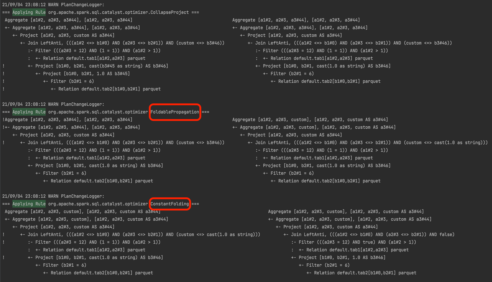

# Hive SQL 作业

## 题目一：为Spark SQL添加一条自定义命令

第一题比较简单，就是跟着老师上课的内容走一遍

### 1、SqlBase.g4 添加相关的关键字

``` antlr
statement
    : query    
    | VERSION

ansiNonReserved
    | VERSION

nonReserved
    | VERSION

//--SPARK-KEYWORD-LIST-START
VERSION: 'VERSION' | 'SJVER';
```

### 2、编译 `antlr`

本地通过 `maven` 插件编译

### 3、增加 ShowVersionCommand 类

``` Scala
/*
 * Licensed to the Apache Software Foundation (ASF) under one or more
 * contributor license agreements.  See the NOTICE file distributed with
 * this work for additional information regarding copyright ownership.
 * The ASF licenses this file to You under the Apache License, Version 2.0
 * (the "License"); you may not use this file except in compliance with
 * the License.  You may obtain a copy of the License at
 *
 *    http://www.apache.org/licenses/LICENSE-2.0
 *
 * Unless required by applicable law or agreed to in writing, software
 * distributed under the License is distributed on an "AS IS" BASIS,
 * WITHOUT WARRANTIES OR CONDITIONS OF ANY KIND, either express or implied.
 * See the License for the specific language governing permissions and
 * limitations under the License.
 */

package org.apache.spark.sql.execution.command

import org.apache.spark.sql.{Row, SparkSession}
import org.apache.spark.sql.catalyst.expressions.{Attribute, AttributeReference}
import org.apache.spark.sql.types.StringType


case class ShowVersionCommand() extends LeafRunnableCommand {

  override val output: Seq[Attribute] =
    Seq(AttributeReference("version", StringType)())

  override def run(sparkSession: SparkSession): Seq[Row] = {
    val sparkVersion = sparkSession.version
    val javaVersion = System.getProperty("java.version")
    val scalaVersion = scala.util.Properties.releaseVersion

    val outputStr = "Spark Version: %s, Java Version: %s, Scala Version: %s"
      .format(sparkVersion, javaVersion, scalaVersion.getOrElse(""))
    Seq(Row(outputStr))
  }
}

```

### 4、将对应实现添加到 `antlr` 编译生成的 `SparkSqlParser.visitShowVersion()` 方法内

``` Scala
/**
* Return the parameters for [[ShowVersionCommand]] logical plan.
*/
override def visitShowVersion(ctx: ShowVersionContext): LogicalPlan = withOrigin(ctx) {
  ShowVersionCommand()
}
```

### 结果


## 题目二：构建满足适用于优化规则的 `SQL`

对于优化规则，除了源代码注释，还查找了一些网上的文章以便理解，个人觉得解释的比较清晰的是这篇：[Spark源码阅读-LogicalPlan[Optimizer LogicalPlan]优化规则](https://zhuanlan.zhihu.com/p/73367613)

### 构建一条SQL，同时apply下面三条优化规则

- CombineFilters
- CollapseProject
- BooleanSimplification

`CombineFilters` 这个规则适用的 `SQL` 找了好久，翻看代码改动记录，找去了 `Apache` 的 `JIRA` [CombineFilters](https://issues.apache.org/jira/browse/SPARK-35273?jql=project%20%3D%20SPARK%20AND%20text%20~%20%22CombineFilters%22%20ORDER%20BY%20updated%20DESC)。结果是用提交者给的 `Example` 也没有得到 `CombineFilters` 的输出。

然后翻代码，发现 `CombineFilters` 只被 `PushDownPredicates` 调用了，所以这边认为谓词下推属于合并过滤器。

``` SQL
CREATE TABLE Tab1(a1 INT, a2 INT) USING parquet;

SELECT (a1_plus_1 +1) AD a1_plus_2,a2 
FROM (
    SELECT (a1 + 1) AS a1_plus_1,a2 FROM tab1 WHERE a1 > 10
) WHERE a1_plus_1 > 1 AND 1 = 1;
```

#### 结果


###  构建一条SQL，同时apply下面五条优化规则

- ConstantFolding
- PushDownPredicates
- ReplaceDistinctWithAggregate
- ReplaceExceptWithAntiJoin
- FoldablePropagation

经过了第一题，发现大多数优化规则在注释内都写了 `Example`。emmmmm，于是就将每个注释的内容拼凑在一起了

``` SQL
CREATE TABLE Tab1(a1 INT, a2 INT) USING parquet;
CREATE TABLE Tab2(b1 INT, b2 INT) USING parquet;


SELECT DISTINCT a1,a2, 'custom' a3 
FROM (
    SELECT * FROM Tab1 WHERE a2 = 12 AND 1 = 1
)  WHERE a1 > 1 AND 1 = 1 
EXCEPT SELECT b1,b2, 1.0 b3 FROM tab2 WHERE b2=6;
```

#### 结果




## 题目三：实现自定义优化规则

具体的过程老师都把代码贴出来了，只需要去实现具体规则就好（就好……）。

尝试写了几个规则，也尝试从其他已有规则里面复制出来，但是都被原始规则先优化掉了……

没什么办法，只能打几行日志，证明优化器检测到并经过了这个自定义的类，

### Code

[CustomRule](../../bigdata-exercise/src/main/scala/org/n0nb0at/spark/sql/extension/CustomRule.scala)

[CustomSparkSessionExtension](../../bigdata-exercise/src/main/scala/org/n0nb0at/spark/sql/extension/CustomSparkSessionExtension.scala)

``` Scala
case class CustomRule(spark: SparkSession) extends Rule[LogicalPlan] with Logging {

  def apply(plan: LogicalPlan): LogicalPlan = {
    logWarning("进入自定义规则")
    plan transform {
      case project@Project(projectList, _) =>
        logWarning("匹配到 Project")
        projectList.foreach {
          name =>
            logWarning("字段名称:" + name)
        }
        project
    }
  }
}
```

``` Scala
class CustomSparkSessionExtension extends (SparkSessionExtensions => Unit) with Logging {
  override def apply(extensions: SparkSessionExtensions): Unit = {
    extensions.injectOptimizerRule { session =>
      logWarning("进入自定义扩展")
      CustomRule(session)
    }
  }
}
```

### 结果


## 个人小结

这次作业感觉难度不是很大，感觉老师的意图应该主要是让大家熟悉 `spark-sql` 解析优化的整体流程，不过中间仍然需要大量的时间阅读、尝试来加深理解。光老师留的作业可能还不够，需要多一些练习。
