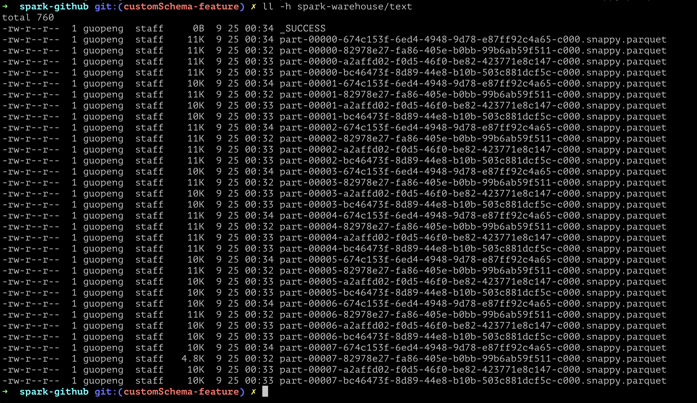
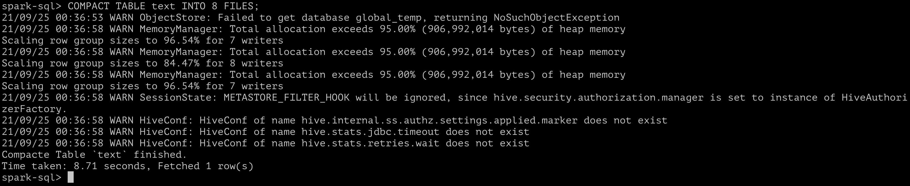
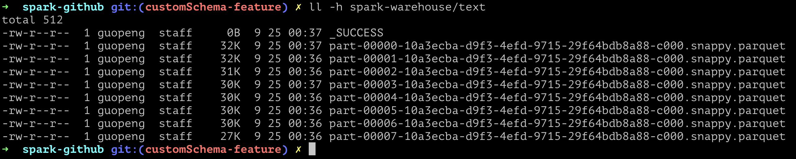
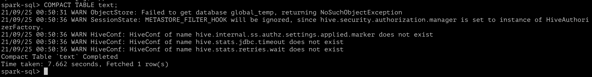
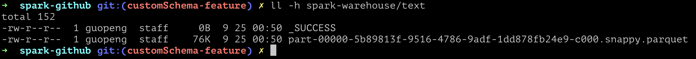

# SparkSQL 优化

## 题目一：如何避免小文件问题

### 小文件产生的问题

为了以后能完整的复习，我觉得还是要把小文件产生的问题也总结一下。老师上课讲到了两个小文件带来的问题：

1. 每个小文件的访问都会访问 NameNode，产生很多 rpc 请求，对 NameNode 造成网络压力
2. 读取数据时，数据源过多的小文件会产生过多的 task，中间 shuffle 也会很多，计算、网络资源都会存在压力

后续查询网上的一些资料，跟老师讲的差不多，稍有差异的大致是以下几点：

1. 除了获取文件数据时对 NameNode 的访问压力，还有小文件元信息数量问题，1 亿个文件元信息就会占用约 20G 存储空间（老师在之前 Hadoop 课程内也提到过）
2. 小文件分布通常是不连续的，对比大文件的顺序读，随机访读性能通常较差，且碎片化的存储有可能造成磁盘空间浪费

### 小文件的来源

1. 在计算过程中因分片分组导致的小文件
2. 源文件本身就是独立的小文件

### 避免方案

1. 避免产生：如因 partition reduce 等配置造成的小文件过多，可通过合理调整切分配置来减少
2. 对小文件进行合并，针对不同场景可以细分：
   - 老师课上讲到的，按时间序分桶的数据，可以在到达一个时间节点后（月初、年初），对历史数据进行一次合并
   - 按文件大小，配置合并阈值，定期检测符合合并大小区间的进行合并

## 题目二：实现Compact table command

与上次实现 `SHOW VERSION` 作业相类似，增加一个 SQL 语句及对应的 `Command` 类实现。

### 大致思路：

1、添加自定义语句到 `SqlBase.g4`：

``` SQL
| COMPACT TABLE target=tableIdentifier partitionSpec?
    (INTO fileNum=INTEGER_VALUE identifier)?                       #compactTable
```

2、添加 `visitCompactTable` 方法到 `SparkSqlParser.scala`

[SparkSqlParser](https://gitee.com/geekuni-gp/spark/blob/customSchema-feature/sql/core/src/main/scala/org/apache/spark/sql/execution/SparkSqlParser.scala)

``` Scala
/**
   * Return the parameters for [[CompactTableCommand]] logical plan.
   */
override def visitCompactTable(ctx: CompactTableContext): LogicalPlan = withOrigin(ctx) {

  val fileNum: Option[Int] = if (ctx.INTEGER_VALUE() == null) {
    None
  } else {
    Some(ctx.INTEGER_VALUE().getText.toInt)
  }
  CompactTableCommand(visitTableIdentifier(ctx.target), fileNum)
}
```

3、实现 `CompactTableCommand` 具体合并逻辑

- [ ] 存在 `ctx.partitionSpec`，则获取指定 partition 目录下的问题件进行操作：`Option(ctx.partitionSpec).map { ...}` （没完成，其他含有 `partitionSpec` 的命令完全没看懂`o(╥﹏╥)o`）
- [x] 通过 `ctx.fileNum` 执行合并后的文件数量
  
- [x] 合并文件：如何合并还没成功实现……基本思路是想批量读取后通过 `repartition` 算子进行操作，还在实验中。

2021-09-25 更新：
自己想了很久，也查询了很多内容，并没有完整的独立完成。最后还是查看了好几个其他班级同学的作业才完成……

[CompactTableCommand](https://gitee.com/geekuni-gp/spark/blob/customSchema-feature/sql/core/src/main/scala/org/apache/spark/sql/execution/command/CompactTableCommand.scala)

``` Scala
case class CompactTableCommand(table: TableIdentifier,
                               fileNum: Option[Int]) extends LeafRunnableCommand {
  private val tmpTable: TableIdentifier = TableIdentifier(table.identifier + "_tmp")

  private val defaultSize = 128 * 1024 * 1024

  override def output: Seq[Attribute] = Seq(
    AttributeReference("compact_table_stmt", StringType, nullable = false)()
  )

  override def run(spark: SparkSession): Seq[Row] = {
    spark.catalog.setCurrentDatabase(table.database.getOrElse("default"))

    val tmpDF = spark.table(table.identifier)
    
    val partitions = fileNum match {
      // 设置了合并数量，则直接使用
      case Some(num) => num
      // 未设置情况下，使用待处理文件大小除以 128M 计算
      case None => (spark.sessionState
        .executePlan(tmpDF.queryExecution.logical)
        .optimizedPlan.stats.sizeInBytes / defaultSize).toInt
    }

    if (partitions <= 0) partitions = 1

    // 重设分区
    tmpDF.repartition(partitions)
      .write.mode(SaveMode.Overwrite)
      .saveAsTable(tmpTable.identifier)

    // 将临时表覆盖到原表
    spark.table(tmpTable.identifier)
      .write.mode(SaveMode.Overwrite)
      .saveAsTable(table.identifier)

    // 清除临时表
    spark.sql(s"DROP TABLE ${tmpTable.identifier}")
    Seq(Row(s"Compact Table $table Completed"))
  }
}
```

### result

原始数据（由于本机性能问题，只创建了少量数据）：



指定合并数量的 SQL 执行：



合并后的结果：



不指定合并数量的默认 SQL 执行：



合并后的结果(因为总量就很少，没超过128M，只合并成了1个文件)：



### 第二题小结

好难啊，一开始上网查询相关内容，感觉完全摸不着头脑，大多都是介绍怎么配置一些 `Hive` 参数，或者写 `Spark SQL` 使用 `REPATITION` 关键字，但是一点也没查到相关实现逻辑。

后续参考了其他班级同学的作业，大致思路好像是没错，但是很多参数、配置完全不知道怎么查……

最后只能在理解之后重写了一遍其他同学的代码……

## 题目三：Insert命令自动合并小文件

``` Shell
TODO 这期估计完不成了，后续国庆期间如果老师或助教没讲解，就再尝试自己做一下
```