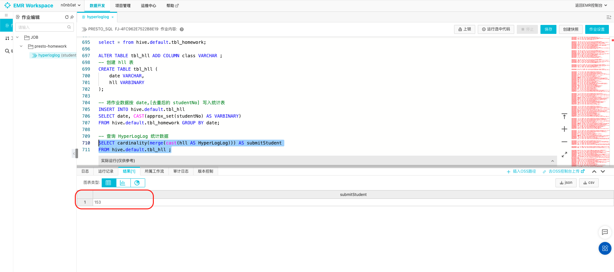
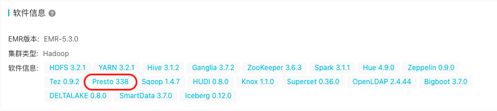
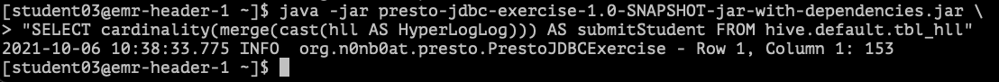
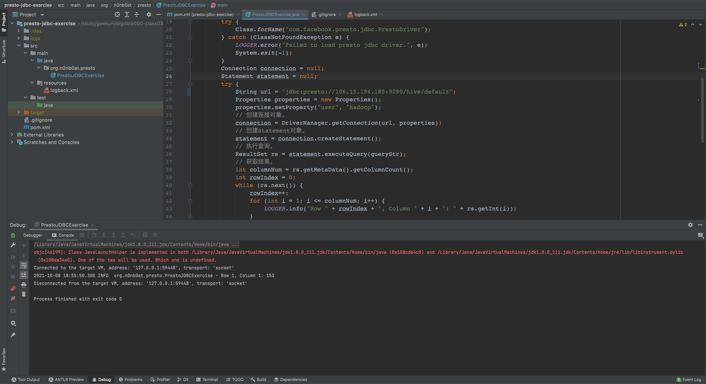

# HyperLogLog算法在Presto的应用

## 题目一：搜索 HyperLogLog 算法相关内容，了解其原理，写出5条HyperLogLog的用途或大数据场景下的实际案例

通过查询，原理讲述较为详实的是 [HyperLogLog 算法详解](https://zhuanlan.zhihu.com/p/77289303)。里面有详细的算法介绍和推导公式，个人只理解了一个大概，公式推导部分没有深究（好多数学知识已经还给大学老师了……）

简明阐述下 HyperLogLog 的应用场景：

- 基数不大、数据量不大的情况，会有点大材小用浪费空间
- 有局限性，就是只能统计基数数量，而没办法知道具体内容是什么

从搜索结果来看，实际案例大致有如下几类：

- 统计注册 IP 数
- 统计每日访问 IP 数
- 统计页面实时 UV 数
- 统计在线用户数
- 统计每天搜索不同词条的个数
- 统计真实文章阅读数

## 题目二：在 Presto 中使用 HyperLogLog 计算近似基数

这边想了一下，周围有可去重场景的应该就是我们的作业提交内容了，就创建了一个表，把我们的作业提交记录写入，作为原始数据（完整SQL内容 [presto.sql](../../bigdata-exercise/src/main/resources/presto.sql)）：

``` SQL 
-- 创建了
CREATE TABLE tbl_homework (
    studentNo VARCHAR,
    studentName VARCHAR,
    class VARCHAR,
    date VARCHAR,
    address VARCHAR
);

-- 插入记录（ 总计616条，下面仅写了第一条示意）
INSERT INTO tbl_homework
VALUES
('G20210579030073','王欢-包头','1班','0711','https://github.com/wanghuan2054/geektime/tree/master'),
...
```

后续将【学号 `studentNo`】作为去重标记，写入到统计表中：

``` SQL
-- 创建统计表
CREATE TABLE tbl_hll (
    date VARCHAR,
    hll VARBINARY
);

-- 将作业数据按 date,[去重后的 studentNo] 写入统计表
INSERT INTO hive.default.tbl_hll
SELECT date, CAST(approx_set(studentNo) AS VARBINARY)
FROM hive.default.tbl_homework GROUP BY date;

-- 查询 HyperLogLog 统计数据
SELECT cardinality(merge(cast(hll AS HyperLogLog))) AS submitStudent
FROM hive.default.tbl_hll ;
```

`E-MR` 查询结果：



应该是数据量太小了，我们现在总共提交过作业的人数的确是 153 人。实际按最开始看到的文章，`HyperLogLog` 大约会有 1.1% 的精度丢失。

***PS.使用 `E-MR` 过程中，也遇到了群里很多同学说的收不到结果，没什么头绪，大多数就是关掉浏览器重新登录访问……***

## 题目三：学习使用 Presto-Jdbc 库连接 Docker 或 E-MapReduce 环境，重复上述查询

查到了阿里云官方帮助文档 [Presto 使用JDBC](https://help.aliyun.com/document_detail/108859.html)，还在尝试中。



查询了集群中的 `Presto` 版本为 338。

后续按照帮助文档进行了本地代码实现，但是集群的默认安全组未开放 `9090` 端口，没有在本地调试成功。

将文件打 jar 包上传后，在云端服务器运行成功了：



后续助教老师帮忙配置了 `Presto` 安全组的 `9090` 端口，本地测试成功（由于节后事务较多，还是用的之前的简单例子处理）：



### Code

代码直接使用的帮助文档实例，只是把需要执行的语句作为参数传递了。也没有进行其他调整，只支持查询结果的简单输出。

[PrestoJDBCExercise](../../presto-jdbc-exercise/src/main/java/org/n0nb0at/presto/PrestoJDBCExercise.java)
