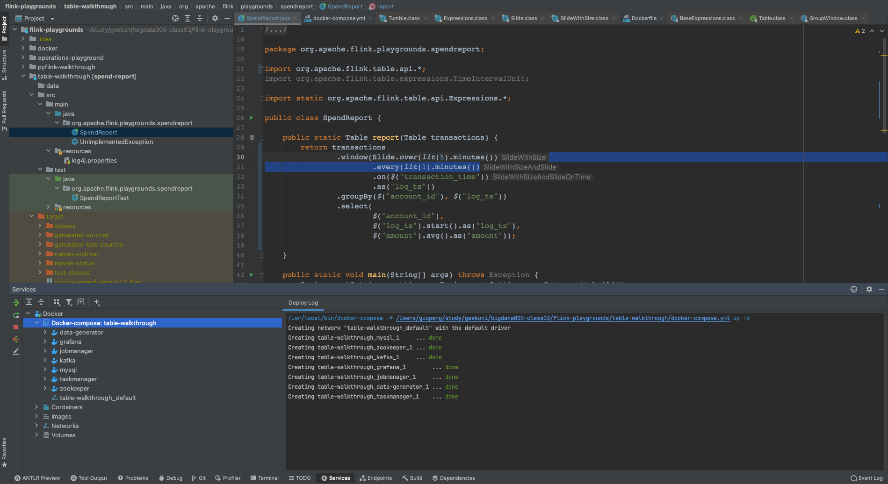
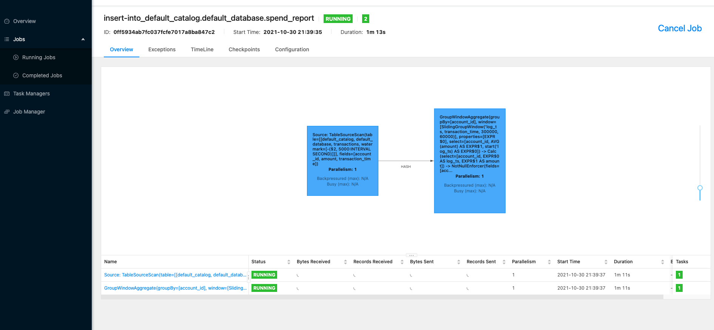
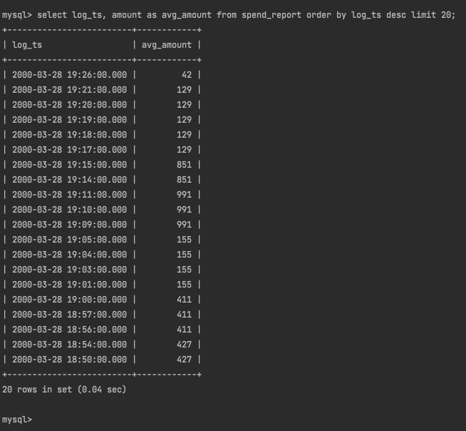
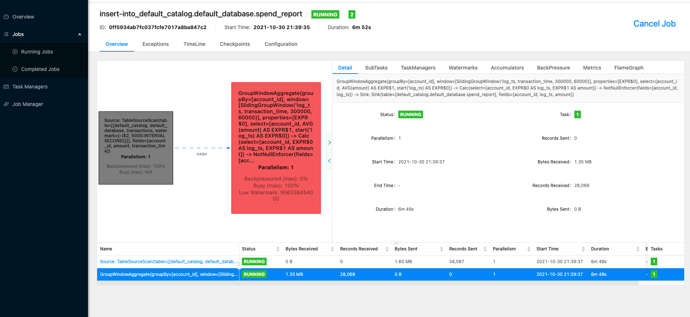
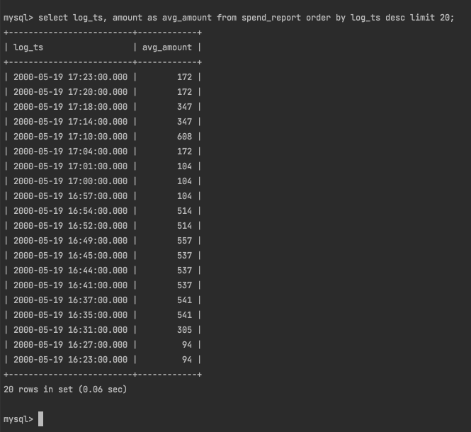
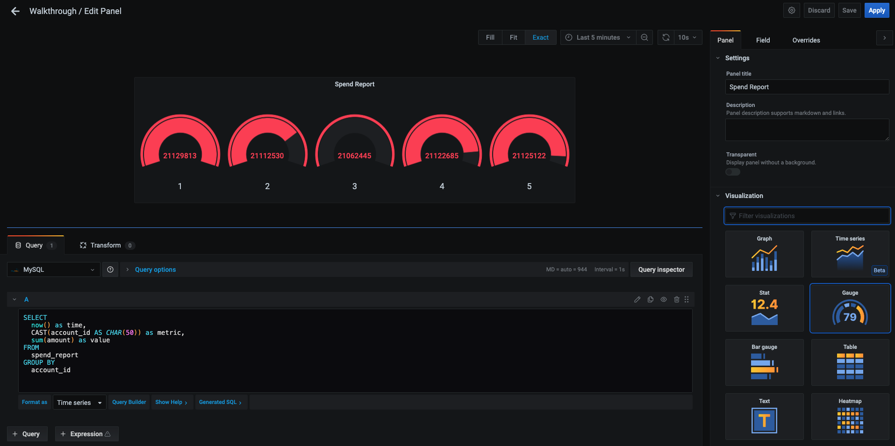

# 1017 Flink

作业完成的较晚，老师请见谅！

## 题目：每分钟（小时）计算在五分钟（小时）内每个账号的平均交易金额（滑动窗口）

对应的内容查询了官方文档：[Table API](https://ci.apache.org/projects/flink/flink-docs-release-1.13/docs/try-flink/table_api/)

大致内容文档内解释的都比较清晰，原案例写的窗口使用的是滚动窗口：[Adding Windows](https://ci.apache.org/projects/flink/flink-docs-release-1.13/docs/try-flink/table_api/#adding-windows)

继续查询了滑动窗口的使用方法：[Sliding Windows](https://ci.apache.org/projects/flink/flink-docs-release-1.13/docs/dev/table/tableapi/#slide-sliding-windows)

## Code

具体代码如下：

``` Java
public static Table report(Table transactions) {
    return transactions
            .window(Slide.over(lit(5).minutes()) // 5分钟内（窗口大小）
                    .every(lit(1).minutes())     // 每1分钟（滑动频率）
                    .on($("transaction_time"))
                    .as("log_ts"))
            .groupBy($("account_id"), $("log_ts"))
            .select($("account_id"),
                    $("log_ts").start().as("log_ts"),
                    $("amount").avg().as("amount")); // 平均交易金额

}
```

## Result

启动 `docker`：



`Flink` 任务：



数据库记录，按时间倒叙查了20条记录：



过了一会再观察，发现 `Flink` 界面有告警信息（可能描述不准确，变色警示，我看任务还在继续跑，应该就是容器内资源被占满了）：



数据库内继续查询，有新记录继续写入：



最后有尝试通过 `Grafana` 查看，但是原始的仪表盘是历史累加，尝试想加一个折线图展示平均消费金额变化，但是截止提交作业时还没整成功，后续研究一下。



## 小结

本次作业就是跟着老师 `PPT` 内容和官网流程走了一遍，不是很难，但是中间有很多衍生的内容要了解。

在 `docker-compose` 上花了些时间，直接按老师的指令走是完全没问题，只是在微调代码后，踩了重新打包的坑，打一次包好几分钟，过程很漫长……

另外，在 `Grafana` 图表上面也花了些时间，还没完全整完。

近期因为值班，作业做的晚了，辛苦助教老师了~
