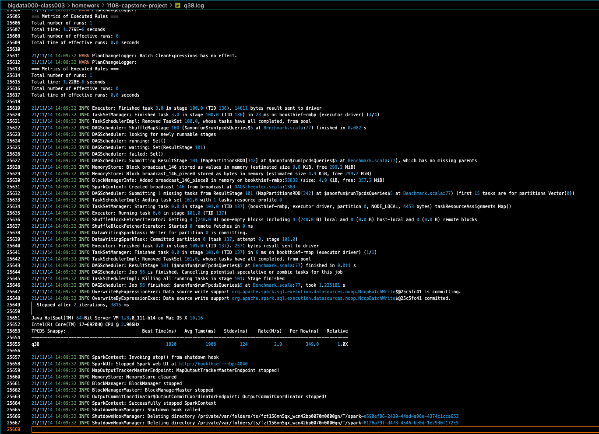
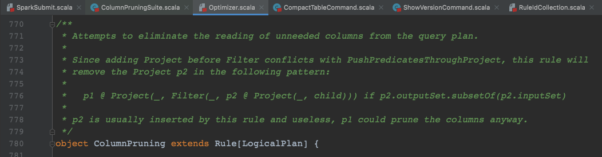
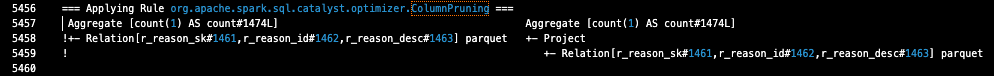
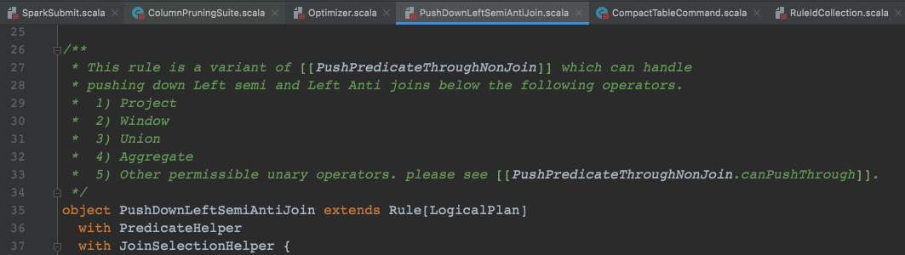

# 毕业项目

## 题目一：分析一条 TPCDS SQL

### 获取优化规则

打开 `WARN`（`--conf "spark.sql.planChangeLog.level=WARN" `） 日志后，`SQL` 整体的执行结果过长，不方便截图。于是将对应日志进行了输出（`... &> q38.log`），具体日志详见 [q38.log](q38.log)。

``` Shell
./spark-3.1.1-bin-hadoop2.7/bin/spark-submit 
--conf "spark.sql.planChangeLog.level=WARN" 
--class org.apache.spark.sql.execution.benchmark.TPCDSQueryBenchmark 
--jars spark-core_2.12-3.1.1-tests.jar,spark-catalyst_2.12-3.1.1-tests.jar spark-sql_2.12-3.1.1-tests.jar 
--data-location tpcds-data-1g --query-filter "q38" 
&> q38.log
```



日志较长，只过滤应用到的优化规则内容 [q38_uniq_optimizer.log](q38_uniq_optimizer.log)：

``` Shell
grep "Applying Rule org.apache.spark.sql.catalyst.optimizer" q38.log|sort | uniq -c > q38_uniq_optimizer.log
```

``` Shell
   3 === Applying Rule org.apache.spark.sql.catalyst.optimizer.CollapseProject ===
  42 === Applying Rule org.apache.spark.sql.catalyst.optimizer.ColumnPruning ===
   3 === Applying Rule org.apache.spark.sql.catalyst.optimizer.ConstantFolding ===
   3 === Applying Rule org.apache.spark.sql.catalyst.optimizer.EliminateLimits ===
   3 === Applying Rule org.apache.spark.sql.catalyst.optimizer.InferFiltersFromConstraints ===
  18 === Applying Rule org.apache.spark.sql.catalyst.optimizer.PushDownLeftSemiAntiJoin ===
   9 === Applying Rule org.apache.spark.sql.catalyst.optimizer.PushDownPredicates ===
  15 === Applying Rule org.apache.spark.sql.catalyst.optimizer.RemoveNoopOperators ===
   3 === Applying Rule org.apache.spark.sql.catalyst.optimizer.ReorderJoin ===
   3 === Applying Rule org.apache.spark.sql.catalyst.optimizer.ReplaceDistinctWithAggregate ===
   3 === Applying Rule org.apache.spark.sql.catalyst.optimizer.ReplaceIntersectWithSemiJoin ===
   3 === Applying Rule org.apache.spark.sql.catalyst.optimizer.RewritePredicateSubquery ===
```

该 `SQL` 总计使用到了 12 条优化规则，这边以使用最多的 `ColumnPruning` 和 `PushDownLeftSemiAntiJoin` 来进行描述。

### 优化规则描述

#### `ColumnPruning`



根据类文件描述，该优化规则会将不需要的列从查询计划中移除。



一开始看到这个例子，感觉并没有按照优化器描述的内容进行列剪裁。

``` Scala
case p @ Project(_, a: Aggregate) if !a.outputSet.subsetOf(p.references) =>
    p.copy(
    child = a.copy(aggregateExpressions = a.aggregateExpressions.filter(p.references.contains)))
```

查了下代码，是判断 `Aggregate` 的结果是否为原 `Project`（即 `p`） 的子集，不是的话就复制一份 `p` 中符合 `aggregateExpressions` 规则的列。而例子中的 `Aggregate` 只是 `Count(1)` 统计，不属于原来映射的三列子集，就创建了一个新的 `Project` 内容和原来的一样。

不知道这个是否有必要，感觉有点像一次冗余的优化，或者说它复制出的 `Project` 还会对后面的查询起效果吗？暂时没从网上查到原因，希望助教老师后续看到后能帮忙解答下，后续有时间我也会继续查一下网上是否有对应的解释。

后续又查询了一个 `OverwriteByExpression` 的优化，对应日志太长，截图和文本看着都会很乱，老师受累到日志内看下，优化后添加的 `Project` 在 `14466` 行后半 [q38.log](q38.log)，将 `JOIN` 的内容简化到了两列。

#### PushDownLeftSemiAntiJoin



根据描述内容，这个是针对『左交/左差连接』进行的谓词下推，是 `PushPredicateThroughNonJoin` 的一个变种。

谓词下推的内容老师在课上多次强调过，是一种很有效的减少 `Shuffle` 阶段数据传输的手段。

对于 `JOIN` 操作，虽然是一个窄依赖，但是如果计划比较复杂或 `JOIN` 双方不在同一个物理机上，还是会涉及到 `Shuffle` 传输，因此针对 `JOIN` 进行谓词下推操作相对来说会很有必要。

`q38` 内相关的例子可见 `8451` `8452` 两行 [q38.log](q38.log)，将 `Join LeftSemi` 操作进行了下移。

### 题目一小结

老师已经将主要流程在文档内进行了梳理，并且之前群内有人趟了坑，最终的操作过程很顺畅。只是将之前老师讲过的优化器查询应用及源码对应的备注进行查看，这一题应该是强化一下我们课程中优化器部分的内容理解。

## 题目二：架构设计题

``` Shell
TODO 还在做，助教老师请见谅，这边最晚会在周一晚上完成对应内容。
```

## 题目三：简述 Spark Shuffle 的工作原理

``` Shell
TODO 还在做，助教老师请见谅，这边最晚会在周一晚上完成对应内容。
```
